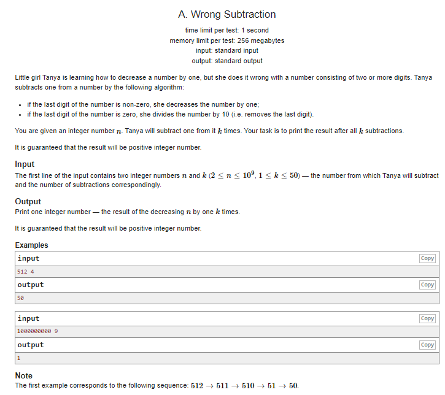
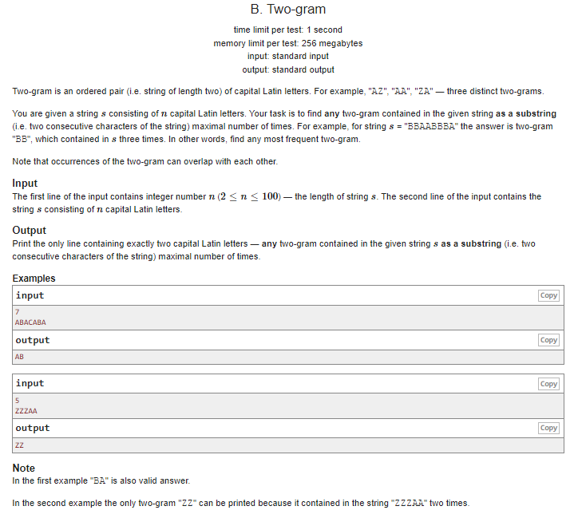
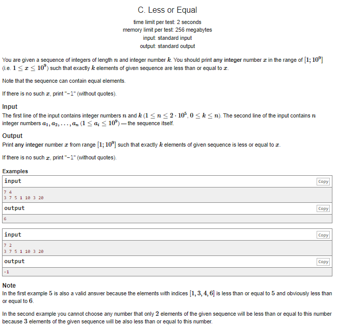
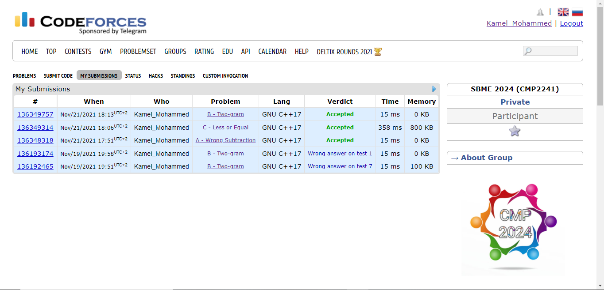

# CMP2241_Task 2 --> Codeforces Contests


## Handle name : Kamel_Mohammed
## Name : Kamel Mohamed
## Sec : 2
## BN : 10


## Solved problems A, B, and C of Codeforces Round #479 (Div. 3)

> A - Wrong Subtraction.

### Problem 1 Solution:
```
#include <bits/stdc++.h>
using namespace std;
 
int main() {
	int n, k;
	cin >> n >> k;
	while (k--) {
		if (n % 10 == 0) {
			n = n / 10;
		}
		else {
			n -= 1;
		}
	}
	cout << n;
}

```

> B - Two gram.

### Problem 2 Solution:
```
#include<bits/stdc++.h>
using namespace std;
 
 
int countRep(string sub);
string str;
 
main() {
    int maxi = 0, n;
    string gram;
    cin >> n >> str;
 
    for (int i = 0; i < str.size() - 1; i++) {
        string sub = str.substr(i, 2); 
        
        int temp = countRep(sub);
 
        if (temp > maxi) {
            maxi = temp;
            gram = sub;
        }
    }
    cout << gram << endl;
}
 
 
int countRep(string sub) {
    int cnt = 0, maxi = 0;
 
    for (int i = 0; i < str.size() - 1; i++) {
        if (str[i] == sub[0] && str[i + 1] == sub[1])
            cnt++;
    }
    return cnt;
}
```

> C - Less of Equal.

### Problem 3 Solution:
```
#include <bits/stdc++.h>
using namespace std;
 
int main() {
	int const N = 2e5;
	int arr[N];
 
	int n, k;
	cin >> n >> k;
	for (int i = 0; i < n; i++) {
		cin >> arr[i];
	}
 
	sort(arr, arr + n);
	if (arr[0] == 1 && k == 0) {
		cout << -1;
	}
	else if (arr[0] >= 1 && k == 0) {
		cout << 1;
	}
	else if (k <= n - 1) {
		if (arr[k - 1] != arr[k]) {
			cout << arr[k - 1];
		}
		else {
			cout << -1;
		}
	}
	else if (k == n) {
		cout << arr[k - 1];
	}
	return 0;
}
```

## Submission Image 

